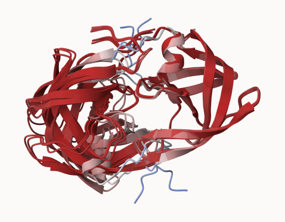

```{r}
library(bio3d)

pdb_files <- list.files("HIV_dimer_23119", pattern = ".pdb$")

pdb <- read.pdb(paste0("HIV_dimer_23119/", pdb_files[1]))

pdb
```

There are two proteins that are included chains A and B with a total of 198 residues and no non-protein atoms, shows AlphaFold model succesffuly predicting the structure. 


Make a vector of input PDB file names that we can read into 

```{r}
pdbfiles <- list.files("HIV_dimer_23119", 
           pattern = ".pdb",
           full.names =TRUE)
pdbfiles
```

```{r}
pdb <- read.pdb("1hsg")
```


```{r}
library(bio3d)

# Read all data from Models 
#  and superpose/fit coords
pdbs <- pdbaln(pdbfiles, fit=TRUE, exefile="msa")
```
All five AlphaFold models show the same sequence with no gaps in the alighnment. 

```{r}
pdbs

```

```{r}
rd <- rmsd(pdbs, fit=T)
```

```{r}
range(rd)

```


```{r}
library(pheatmap)
colnames(rd) <- paste0("m",1:5)
rownames(rd) <- paste0("m",1:5)
pheatmap(rd)
```

the heatmap reveals how clustered the structurally similar models.Models 1-3 seem more related to one another. They may show different conformations for the dimer. Models 4-5 are similar to each other and are more disimilar to models 1 and 2 than 3. 

```{r}
pdb <- read.pdb("1hsg")
```

```{r}
plotb3(pdbs$b[1,], typ="l", lwd=2, sse=pdb)
points(pdbs$b[2,], typ="l", col="red")
points(pdbs$b[3,], typ="l", col="blue")
points(pdbs$b[4,], typ="l", col="darkgreen")
points(pdbs$b[5,], typ="l", col="orange")
abline(v=100, col="gray")
```

to find the consistent "rigid core" across all models `core.find` is used.

```{r}
core <- core.find(pdbs)
```

```{r}
core.inds <- print(core, vol=0.5)
```

This takes the identified core atoms and writes them to a fitted structures in a directory , these superposed coordinates are written to `corefit_structures`

```{r}
xyz <- pdbfit(pdbs, core.inds, outpath="corefit_structures")
```




rmsf is used to measure the conformational variance, lower values demonstrate structural similarity. 

```{r}
rf <- rmsf(xyz)

#plotting rf

plotb3(rf, sse=pdb, ylab = "RMSF")
abline(v=100, col="gray")
```

The RMSF profile is inverted compared to the lab manuel due to the ordering of the dimer chains differing in my AlphaFold predicaiton. Same trend is observed overall as one chain is rigid and the other has more variability in its conformation.

A revered RMSF vector:

```{r}
rf <- rev(rmsf(xyz))

plotb3(rf, sse=pdb, ylab="RMSF")
abline(v=100, col="gray")
```


```{r}
library(jsonlite)

results_dir <- "HIV_dimer_23119/"

pae_files <- list.files(
  path = results_dir,
  pattern = ".*model.*\\.json",
  full.names = TRUE
)

pae_files
```


```{r}
pae1 <- read_json(pae_files[1],simplifyVector = TRUE)
pae5 <- read_json(pae_files[5],simplifyVector = TRUE)

attributes(pae1)
```

```{r}
# Per-residue pLDDT scores 
#  same as B-factor of PDB..
head(pae1$plddt) 
```


```{r}
pae1$max_pae
```


```{r}
plot.dmat(pae1$pae, 
          xlab="Residue Position (i)",
          ylab="Residue Position (j)")
```

```{r}
plot.dmat(pae5$pae, 
          xlab="Residue Position (i)",
          ylab="Residue Position (j)",
          grid.col = "black",
          zlim=c(0,30))
```


```{r}
plot.dmat(pae1$pae, 
          xlab="Residue Position (i)",
          ylab="Residue Position (j)",
          grid.col = "black",
          zlim=c(0,30))
```

Demonstrates error in alighnments, lower PAE = more confidence. 

```{r}
pae2 <- read_json(pae_files[2], simplifyVector = TRUE)
pae3 <- read_json(pae_files[3], simplifyVector = TRUE)
pae4 <- read_json(pae_files[4], simplifyVector = TRUE)

pae2$max_pae
pae3$max_pae
pae4$max_pae
```


The PAE values show how model 5 is worse than model 1 as the PAE scores are higher for model 5. Lower scores are preffered. The other models their PAE scores are 18.67188 for model 2, 14.39062 for model 3, and 29.57812 for model 4. 

```{r}
aln_file <- list.files(path=results_dir,
                       pattern=".a3m$",
                        full.names = TRUE)
aln_file
```

```{r}
aln <- read.fasta(aln_file[1], to.upper = TRUE)
```

```{r}
dim(aln$ali)
```


```{r}
sim <- conserv(aln)
```

Plot to demonstrate conservation, highly conserved residues are visualized through the graph. 

```{r}
plotb3(sim[1:99], sse=trim.pdb(pdb, chain="A"),
       ylab="Conservation Score")
```


```{r}
con <- consensus(aln, cutoff = 0.9)
con$seq
```


```{r}
m1.pdb <- read.pdb(pdbfiles[1])
occ <- vec2resno(c(sim[1:99], sim[1:99]), m1.pdb$atom$resno)
write.pdb(m1.pdb, o=occ, file="m1_conserv.pdb")
```


