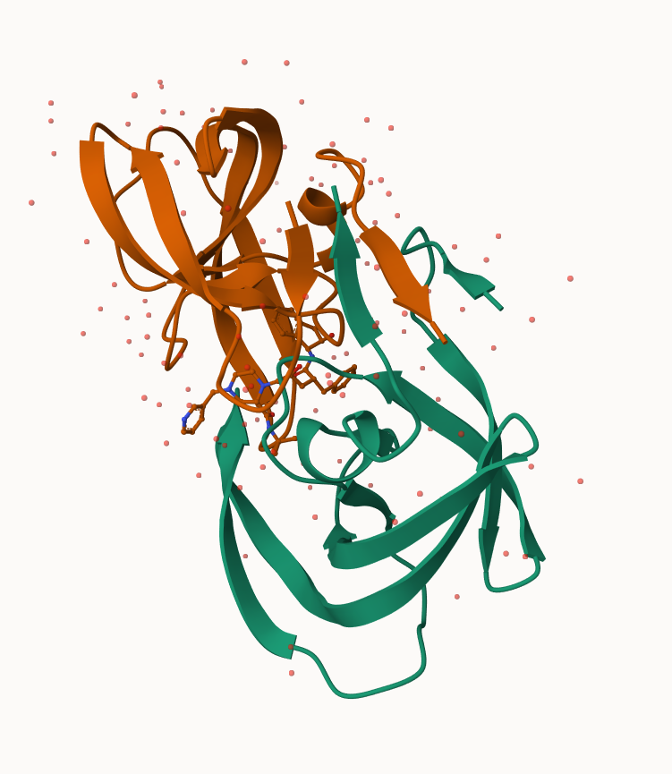
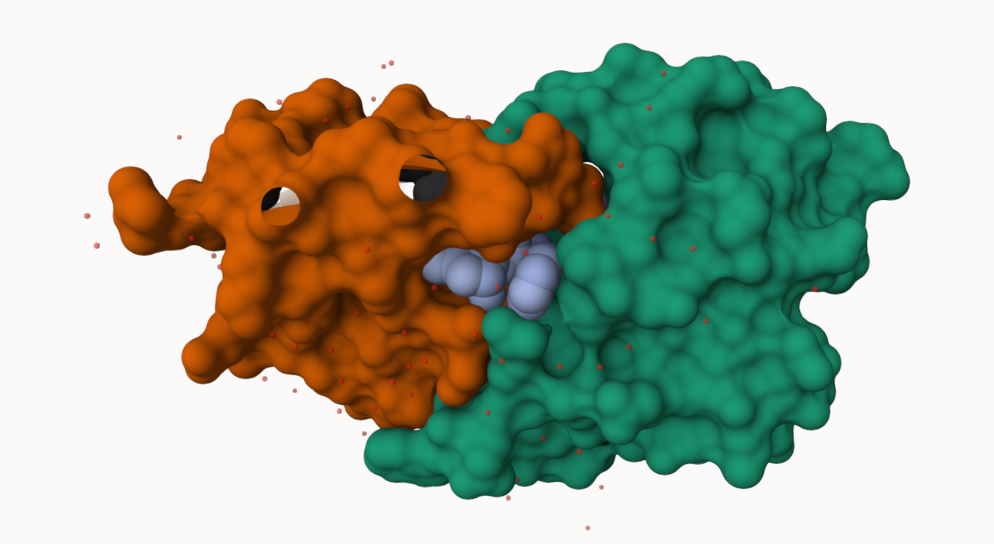
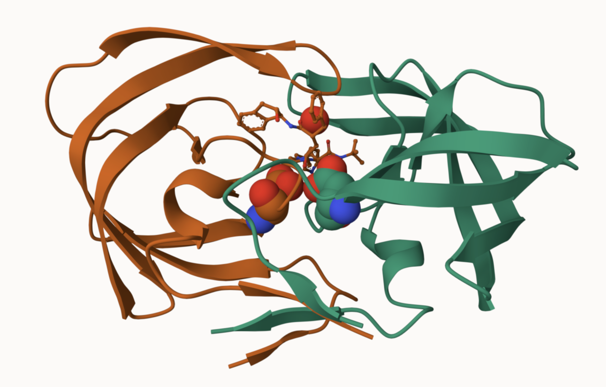

## Background

The main repository of high-resolution structural data on biomolecules is called the **Protein Data Bank**

## PDB Statistics

Read a CSV file from a current PDB stats obtained from 

```{r}
pdb <- read.csv("Data Export Summary.csv")
pdb
```

>Q1: What percentage of structures in the PDB are solved by X-Ray and Electron Microscopy


Around 80.49% of PDB structures are solved by X-Ray and  13.38% by electron microscopy

```{r}
pdb$X.ray
```

The Print out above is `pdb$X.ray` is "character" not ""numeric".  Therefore, I can't do math w/ it. We need to fix this...


```{r}
pdb$Neutron
```

```{r}
#We want to remove commmas: 
x <- pdb$X.ray
tmp <- sub(",","" ,x)
sum(as.numeric(tmp))
```

We could make a function to do this: 

```{r}
rm.comma <-  function (x){
  tmp <- sub(",", "", x)
  sum(as.numeric(tmp))
  
}
```

```{r}
n.tot  <- rm.comma(pdb$Total)
n.xray <- rm.comma(pdb$X.ray)
n.em   <- rm.comma(pdb$EM)

n.xray/n.tot * 100
n.em/n.tot * 100
```

DIfferent import function for this cvs file thhat speaks American (i.e deals w/ commas in umbers in a comma seperated value file). 

```{r}
library(readr)

pdb <- read_csv("Data Export Summary.csv")
```


```{r}
pdb$Total
```


```{r}
n.tot <- (pdb$Total)
n.xray <- sum(pdb$`X-ray`)
sum(pdb$`X-ray`) / n.tot

n.xray / n.tot * 100
n.em / n.tot * 100
```

```{r}
pdb$Total[1]
```


```{r}
{
tmp <-  sub(",", "", x)
sum(as.numeric(tmp))
}

```


The total number of protein sequences is 202,556,314

```{r}
sum(pdb$Total[1:3]) / sum(pdb$Total) * 100
```


```{r}
protein <- 217375 + 14283 + 16277
total <- 217375 + 14283 + 16277 + 5004 + 244 + 22

protein / total * 100
```


>Q2: What proportion of structures in the PDB are protein?

Around 98% in the PDB are protein


```{r}
217375/2025556314 * 100
```


> **Key-Point**: We have a very small structural coverage of known proteins (-0.1%). Most structures wwe know about (80%) come from one method. 

## Visualizing PDB data w/ Mol-star

>Q3: Type HIV in the PDB website search box on the home page and determine how many HIV-1 protease structures are in the current PDB?

More than 4000 structures 

Main stand alone web version w/ all features is at https://molstar.org/viewer/






>Q4: Water molecules normally have 3 atoms. Why do we see just one atom per water molecule in this structure?

This is because only the Oxygen atom can be detected as Hydrogen atoms are too small for the X-ray crystallography at this resoltuon to detect


>Q6: Generate and save a figure clearly showing the two distinct chains of HIV-protease along with the ligand. You might also consider showing the catalytic residues ASP 25 in each chain and the critical water (we recommend “Ball & Stick” for these side-chains). Add this figure to your Quarto document.




# Getting started with the Bio3D package

```{r}
library(bio3d)

pdb <- read.pdb("1hsg")
pdb
```


```{r}
attributes(pdb)
```

```{r}
head(pdb$atom, 5) 
```

There are lots of functions that can work with these `pdb` objects

```{r}
head(pdbseq(pdb))

```


We hcan have a quick interactove view of any of these 'pdb' objects: 

```{r}
library(bio3dview)

#view.pdb(pdb)
```


custom view 

```{r}
#view.pdb(pdb, colorScheme="see", backgroundColor ="black")
```

>Q. Create a custom view highlighting the active site ASP ('resno=25'), the two chains (in your choice of colors) and the ligand all on a custon color background?


```{r}

library(NGLVieweR)

active.site <- atom.select(pdb,resno=25)

#view.pdb(pdb,
#         cols = c("red", "blue"),
#         highlight = active.site, 
#         highlight.style = "spacefill",
#         backgroundColor= "pink") |>
#setRock()
```


# Predict the Flexibility of a given structure 

Let's do a Normal Mode Analysis (NMA) to predict the flexibility of a given `pdb` object: 


```{r}
adk <- read.pdb("6s36")
```

A quick structure summary 
```{r}
adk

```


```{r}
m <- nma(adk)
plot(m)
```

View the results 

```{r}
#view.nma(m)
```


Write out the results in Mol-star: 

```{r}
mktrj(m, file="nma.pdb")
```


## Comparative analysis of the ADK family

>Q10. Which of the packages above is found only on BioConductor and not CRAN? 

msa is the package only on Bioconductor
>Q11. Which of the above packages is not found on BioConductor or CRAN?: 

 bio3d#view not found on BioConductor or CRAN
>Q12. True or False? Functions from the pak package can be used to install packages from GitHub and BitBucket? 

True

Our first step is find a sequence for this family using database ID "1ake_A"

```{r}
id <- "1ake_A"
aa <- get.seq(id)
aa
```

>Q13. How many amino acids are in this sequence, i.e. how long is this sequence? 

there are 214 amino acids

```{r}
#blast <- blast.pdb(aa)
```

```{r}
#head(blast$hit.tbl)
```


```{r}
#hits <- plot(blast)
```


```{r}
hits <- NULL
hits$pdb.id <- 
hits$pdb.id <- c('1AKE_A','6S36_A','6RZE_A','3HPR_A','1E4V_A','5EJE_A','1E4Y_A','3X2S_A','6HAM_A' , '8PVW_A', '4K46_A', '4NP6_A')
```


```{r}
hits$pdb.id
```


```{r}
files <- get.pdb(hits$pdb.id, path="pdbs", split=TRUE, gzip=TRUE)

```


ALign and superpose all the ADK structures 

```{r}
pdbs <- pdbaln(files, fit = TRUE, exefile="msa")
```

```{r}
pdbs
```

Quick interactive structural view 

```{r}
#view.pdbs(pdbs)
```


PCA of all this structural data (x, y, and z atom coordinates)

```{r}
pc <- pca(pdbs)
plot(pc)
```

```{r}
plot(pc, 1:2)
```

Interactive view of the PC1 captured structural differences:

```{r}
#view.pca(pc)
```


```{r}
mktrj(pc, file="pca.pdb")
```


3


