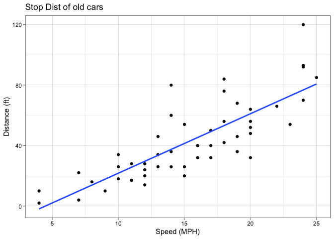
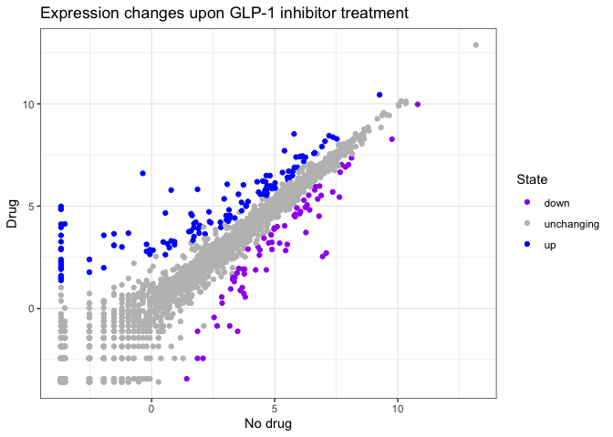
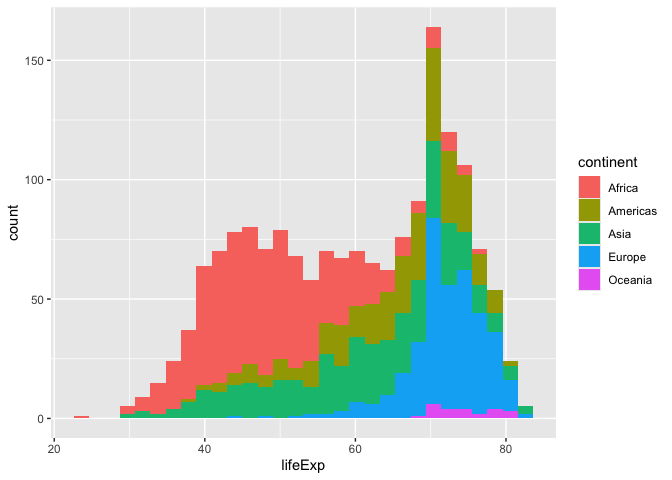
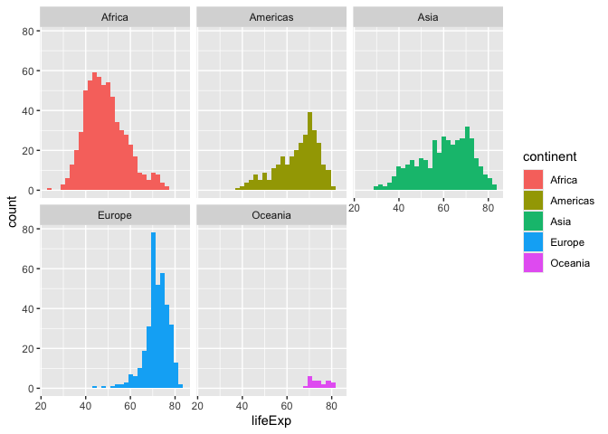
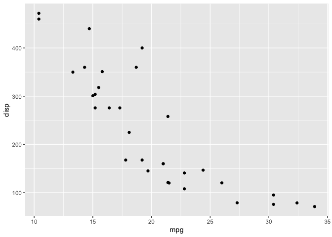

# class 5: Data Viz w/ ggplot2
Niam (PID:A17805610)

- [Add some custom features](#add-some-custom-features)
- [Going Further](#going-further)

\##Background

There are many graphics system in R for making plots anf figures. These
include so-called *“base R” graphics* like the ‘plot()’ function and add
on packages like **ggplot2**.

Let’s compare how we make a simple figure with these two systems:

We can use the in-built “cars” dataset:

``` r
head(cars)
```

      speed dist
    1     4    2
    2     4   10
    3     7    4
    4     7   22
    5     8   16
    6     9   10

``` r
plot(cars)
```


Before I can use ggplot2 I need to install it on my computer. To do this
we can use the function ‘install.packages(ggplot2)’

> **N.B.** We never run ‘install.packages()’ in our quarto doc (we run
> it once only in our R console) as it would re-install the package
> every time we render our quarto package

Once instakked we need ti koad up the package into our R brain:

``` r
library(ggplot2)
```

The main function in the **ggplot2** paackage is called ggplot()

``` r
ggplot(cars)
```


every ggplot has at least 3 layers:

- the **data** (a data.frame of the stuff we want to plot)
- the **aes**thetics (how the data maps on the plot),
- the **geom** layer (how you want the plot drawn, e.g points, lines,
  etc.)

``` r
ggplot(cars)+
  aes(x= speed, y= dist) +
  geom_point()
```


## Add some custom features

Let’s add a trend line that shows the relationship between speed and
distance.

``` r
ggplot(cars)+
  aes(x= speed, y= dist) +
  geom_point() +
  geom_smooth(method = "lm", se= FALSE) +
  theme_linedraw() +
  labs(title="Stop Dist of old cars",
       x="Speed (MPH)", 
       y= "Distance (ft)")
```

    `geom_smooth()` using formula = 'y ~ x'



> Q. Can you make the ’geom_smooth()” function produce a linear straight
> line fit to the data and turn off the “gray” error region.

------------------------------------------------------------------------

\##Gene Expression

Import the data to plot

``` r
url <- "https://bioboot.github.io/bimm143_S20/class-material/up_down_expression.txt"
genes <- read.delim(url)
head(genes)
```

            Gene Condition1 Condition2      State
    1      A4GNT -3.6808610 -3.4401355 unchanging
    2       AAAS  4.5479580  4.3864126 unchanging
    3      AASDH  3.7190695  3.4787276 unchanging
    4       AATF  5.0784720  5.0151916 unchanging
    5       AATK  0.4711421  0.5598642 unchanging
    6 AB015752.4 -3.6808610 -3.5921390 unchanging

``` r
sum(genes$State == "up")
```

    [1] 127

A useful new function in this context is the ‘table()’ function:

``` r
table(genes$State)
```


          down unchanging         up 
            72       4997        127 

My first plot attempt

``` r
ggplot(genes) + 
  aes(Condition1, Condition2, col=State) + 
  geom_point() +
  scale_color_manual(values=c("purple","gray", "blue")) +
  theme_bw() +
  labs(x="No drug", y="Drug",
       title= "Expression changes upon GLP-1 inhibitor treatment")
```



## Going Further

Here we read the famous gapmider dataset:

``` r
url <- "https://raw.githubusercontent.com/jennybc/gapminder/master/inst/extdata/gapminder.tsv"

gapminder <- read.delim(url)
head(gapminder)
```

          country continent year lifeExp      pop gdpPercap
    1 Afghanistan      Asia 1952  28.801  8425333  779.4453
    2 Afghanistan      Asia 1957  30.332  9240934  820.8530
    3 Afghanistan      Asia 1962  31.997 10267083  853.1007
    4 Afghanistan      Asia 1967  34.020 11537966  836.1971
    5 Afghanistan      Asia 1972  36.088 13079460  739.9811
    6 Afghanistan      Asia 1977  38.438 14880372  786.1134

> Q. How many enrtries (i.e. rows) are in this dataset?

``` r
nrow(gapminder)
```

    [1] 1704

> Q. How many different country entries are in this dataset?

``` r
length(table(gapminder$country))
```

    [1] 142

``` r
length(unique(gapminder$country))
```

    [1] 142

Let’s make our first plot of the entire dataset

Plot of “gdppPercap” vs “lifeExp” colored by “continent”

``` r
p <- ggplot(gapminder) +
  aes(gdpPercap, lifeExp, col= continent) +
  geom_point(alpha= 0.3)
```

``` r
p 
```


I can add more layers to p …

``` r
p +
  facet_wrap(~continent)
```


make a plot for years 1977 and 2007 only.

> Q. First use the **dplyr** package and the ‘filter()’ function from
> that package to extract the rows from the year 2007.

``` r
library(dplyr)
```

``` r
head(filter(gapminder, year == 2007))
```

          country continent year lifeExp      pop  gdpPercap
    1 Afghanistan      Asia 2007  43.828 31889923   974.5803
    2     Albania    Europe 2007  76.423  3600523  5937.0295
    3     Algeria    Africa 2007  72.301 33333216  6223.3675
    4      Angola    Africa 2007  42.731 12420476  4797.2313
    5   Argentina  Americas 2007  75.320 40301927 12779.3796
    6   Australia   Oceania 2007  81.235 20434176 34435.3674

``` r
g07 <- filter(gapminder, year == 2007)
g77 <- filter(gapminder, year == 1977)
g <- filter(gapminder, year ==2007 | year == 1977)
```

``` r
ggplot(g) +
aes(gdpPercap, lifeExp, col=continent, size=pop) +
  geom_point() +
  facet_wrap(~year)
```


> Q. Make a histogram of life exp colored by continent Q. Make a
> histogram of lifeExp faceted by continent

``` r
ggplot(gapminder) +
  aes(x = lifeExp, fill = continent) +
  geom_histogram()
```

    `stat_bin()` using `bins = 30`. Pick better value `binwidth`.



``` r
ggplot(gapminder) +
  aes(lifeExp, fill = continent) +
  geom_histogram() + 
facet_wrap(~ continent)
```

    `stat_bin()` using `bins = 30`. Pick better value `binwidth`.



``` r
ggplot(mtcars) + aes(x=mpg, y=disp) + geom_point()
```



``` r
ggplot(mtcars, aes(mpg, disp)) + geom_point()
```


