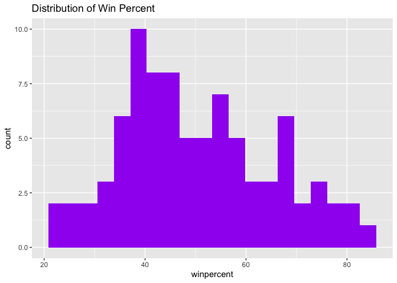
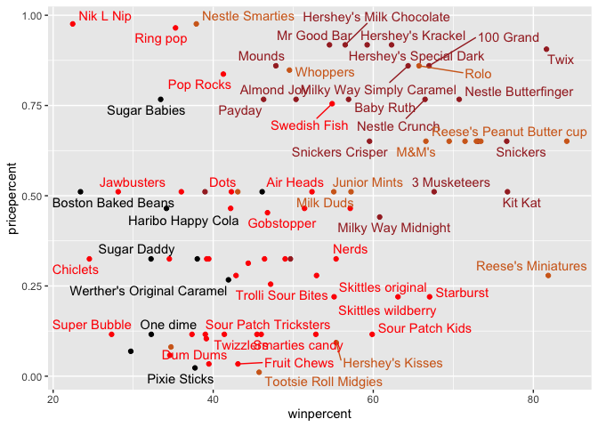
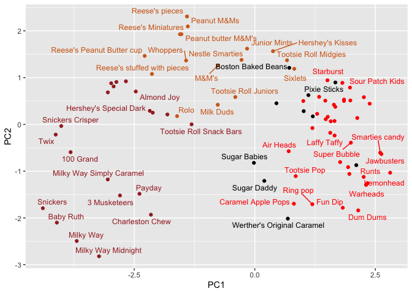
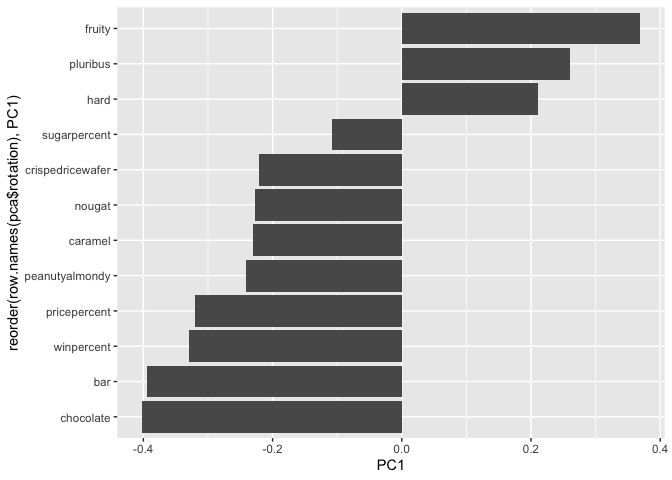

# class09
Niam Shasha A17805610

- [Data Import](#data-import)
- [Taking a look at pricepercent](#taking-a-look-at-pricepercent)
- [Exploring the correleation
  structure](#exploring-the-correleation-structure)
- [PCA](#pca)

## Data Import

``` r
candy <- read.csv("candy-data.txt", row.names=1)
head(candy)
```

                 chocolate fruity caramel peanutyalmondy nougat crispedricewafer
    100 Grand            1      0       1              0      0                1
    3 Musketeers         1      0       0              0      1                0
    One dime             0      0       0              0      0                0
    One quarter          0      0       0              0      0                0
    Air Heads            0      1       0              0      0                0
    Almond Joy           1      0       0              1      0                0
                 hard bar pluribus sugarpercent pricepercent winpercent
    100 Grand       0   1        0        0.732        0.860   66.97173
    3 Musketeers    0   1        0        0.604        0.511   67.60294
    One dime        0   0        0        0.011        0.116   32.26109
    One quarter     0   0        0        0.011        0.511   46.11650
    Air Heads       0   0        0        0.906        0.511   52.34146
    Almond Joy      0   1        0        0.465        0.767   50.34755

> Q1. How many different candy types are in this dataset?

``` r
dim(candy)
```

    [1] 85 12

there are 85 different candy types

> Q2. How many fruity candy types are in the dataset?

``` r
sum(candy$fruity)
```

    [1] 38

There are 38 fruity candy types

``` r
candy["Twix", ]$winpercent
```

    [1] 81.64291

> Q3. What is your favorite candy (other than Twix) in the dataset and
> what is it’s winpercent value?

``` r
candy["Milky Way", ]$winpercent
```

    [1] 73.09956

The wninepercent value is 73.09956 of Milky Way.

> Q4. What is the winpercent value for “Kit Kat”?

``` r
candy["Kit Kat", ]$winpercent
```

    [1] 76.7686

The winepercent value is 76.7686

> Q5. What is the winpercent value for “Tootsie Roll Snack Bars”?

``` r
candy["Tootsie Roll Snack Bars", ]$winpercent
```

    [1] 49.6535

The winepercent value is 49.6535 of a tootsie roll.

``` r
skimr::skim(candy)
```

|                                                  |       |
|:-------------------------------------------------|:------|
| Name                                             | candy |
| Number of rows                                   | 85    |
| Number of columns                                | 12    |
| \_\_\_\_\_\_\_\_\_\_\_\_\_\_\_\_\_\_\_\_\_\_\_   |       |
| Column type frequency:                           |       |
| numeric                                          | 12    |
| \_\_\_\_\_\_\_\_\_\_\_\_\_\_\_\_\_\_\_\_\_\_\_\_ |       |
| Group variables                                  | None  |

Data summary

**Variable type: numeric**

| skim_variable | n_missing | complete_rate | mean | sd | p0 | p25 | p50 | p75 | p100 | hist |
|:---|---:|---:|---:|---:|---:|---:|---:|---:|---:|:---|
| chocolate | 0 | 1 | 0.44 | 0.50 | 0.00 | 0.00 | 0.00 | 1.00 | 1.00 | ▇▁▁▁▆ |
| fruity | 0 | 1 | 0.45 | 0.50 | 0.00 | 0.00 | 0.00 | 1.00 | 1.00 | ▇▁▁▁▆ |
| caramel | 0 | 1 | 0.16 | 0.37 | 0.00 | 0.00 | 0.00 | 0.00 | 1.00 | ▇▁▁▁▂ |
| peanutyalmondy | 0 | 1 | 0.16 | 0.37 | 0.00 | 0.00 | 0.00 | 0.00 | 1.00 | ▇▁▁▁▂ |
| nougat | 0 | 1 | 0.08 | 0.28 | 0.00 | 0.00 | 0.00 | 0.00 | 1.00 | ▇▁▁▁▁ |
| crispedricewafer | 0 | 1 | 0.08 | 0.28 | 0.00 | 0.00 | 0.00 | 0.00 | 1.00 | ▇▁▁▁▁ |
| hard | 0 | 1 | 0.18 | 0.38 | 0.00 | 0.00 | 0.00 | 0.00 | 1.00 | ▇▁▁▁▂ |
| bar | 0 | 1 | 0.25 | 0.43 | 0.00 | 0.00 | 0.00 | 0.00 | 1.00 | ▇▁▁▁▂ |
| pluribus | 0 | 1 | 0.52 | 0.50 | 0.00 | 0.00 | 1.00 | 1.00 | 1.00 | ▇▁▁▁▇ |
| sugarpercent | 0 | 1 | 0.48 | 0.28 | 0.01 | 0.22 | 0.47 | 0.73 | 0.99 | ▇▇▇▇▆ |
| pricepercent | 0 | 1 | 0.47 | 0.29 | 0.01 | 0.26 | 0.47 | 0.65 | 0.98 | ▇▇▇▇▆ |
| winpercent | 0 | 1 | 50.32 | 14.71 | 22.45 | 39.14 | 47.83 | 59.86 | 84.18 | ▃▇▆▅▂ |

``` r
library("skimr")
skim(candy)
```

|                                                  |       |
|:-------------------------------------------------|:------|
| Name                                             | candy |
| Number of rows                                   | 85    |
| Number of columns                                | 12    |
| \_\_\_\_\_\_\_\_\_\_\_\_\_\_\_\_\_\_\_\_\_\_\_   |       |
| Column type frequency:                           |       |
| numeric                                          | 12    |
| \_\_\_\_\_\_\_\_\_\_\_\_\_\_\_\_\_\_\_\_\_\_\_\_ |       |
| Group variables                                  | None  |

Data summary

**Variable type: numeric**

| skim_variable | n_missing | complete_rate | mean | sd | p0 | p25 | p50 | p75 | p100 | hist |
|:---|---:|---:|---:|---:|---:|---:|---:|---:|---:|:---|
| chocolate | 0 | 1 | 0.44 | 0.50 | 0.00 | 0.00 | 0.00 | 1.00 | 1.00 | ▇▁▁▁▆ |
| fruity | 0 | 1 | 0.45 | 0.50 | 0.00 | 0.00 | 0.00 | 1.00 | 1.00 | ▇▁▁▁▆ |
| caramel | 0 | 1 | 0.16 | 0.37 | 0.00 | 0.00 | 0.00 | 0.00 | 1.00 | ▇▁▁▁▂ |
| peanutyalmondy | 0 | 1 | 0.16 | 0.37 | 0.00 | 0.00 | 0.00 | 0.00 | 1.00 | ▇▁▁▁▂ |
| nougat | 0 | 1 | 0.08 | 0.28 | 0.00 | 0.00 | 0.00 | 0.00 | 1.00 | ▇▁▁▁▁ |
| crispedricewafer | 0 | 1 | 0.08 | 0.28 | 0.00 | 0.00 | 0.00 | 0.00 | 1.00 | ▇▁▁▁▁ |
| hard | 0 | 1 | 0.18 | 0.38 | 0.00 | 0.00 | 0.00 | 0.00 | 1.00 | ▇▁▁▁▂ |
| bar | 0 | 1 | 0.25 | 0.43 | 0.00 | 0.00 | 0.00 | 0.00 | 1.00 | ▇▁▁▁▂ |
| pluribus | 0 | 1 | 0.52 | 0.50 | 0.00 | 0.00 | 1.00 | 1.00 | 1.00 | ▇▁▁▁▇ |
| sugarpercent | 0 | 1 | 0.48 | 0.28 | 0.01 | 0.22 | 0.47 | 0.73 | 0.99 | ▇▇▇▇▆ |
| pricepercent | 0 | 1 | 0.47 | 0.29 | 0.01 | 0.26 | 0.47 | 0.65 | 0.98 | ▇▇▇▇▆ |
| winpercent | 0 | 1 | 50.32 | 14.71 | 22.45 | 39.14 | 47.83 | 59.86 | 84.18 | ▃▇▆▅▂ |

> Q6. Is there any variable/column that looks to be on a different scale
> to the majority of the other columns in the dataset?

the variables and columns that are on different scales as compared to
the majority of the other columns is winpercent this is because most
vairables have a value of 0 or 1, and 0 to 1. However, winperecent
ranges from values between 1 to 100 which is at a significantly higher
scale than the other columns that are limited to values between 0 and 1.

> Q7. What do you think a zero and one represent for the
> candy\$chocolate column?

The zero represents that the candy has no chcolate and the one
represents the candy has chocolate

> Q8. Plot a histogram of winpercent values using both base R and
> ggplot2.

``` r
hist(candy$winpercent)
```


``` r
library(ggplot2)

ggplot(candy) +
  aes(winpercent) +
  geom_histogram(bins = 20, fill="purple") +
  ggtitle("Distribution of Win Percent")
```



> Q9. Is the distribution of winpercent values symmetrical?

No, it seems to be slightly skewed with a slight right skew.

> Q10. Is the center of the distribution above or below 50%?

``` r
mean(candy$winpercent)
```

    [1] 50.31676

``` r
median(candy$winpercent)
```

    [1] 47.82975

``` r
summary(candy$winpercent)
```

       Min. 1st Qu.  Median    Mean 3rd Qu.    Max. 
      22.45   39.14   47.83   50.32   59.86   84.18 

The center of the distribution is approximately below 50% as the median
is slightly below 50% at 47.83% the mean is at 50.32% which indicates
that the center is approximaelty but more slightly below 50% as the
median is below 50% and it represent the center of the data.

> Q11. On average is chocolate candy higher or lower ranked than fruit
> candy?

``` r
choc.ind <- as.logical(candy$chocolate)
choc.candy <- candy[choc.ind, ]
choc.win <-  choc.candy$winpercent
mean(choc.win)
```

    [1] 60.92153

``` r
fruit.ind <- as.logical(candy$fruity)
fruit.candy <- candy[fruit.ind,]
fruit.win <- fruit.candy$winpercent
mean(fruit.win)
```

    [1] 44.11974

Chocolate candy is ranked higher than fruit candy at 60.92153 and fruity
candy is ranked 44.11974.

> Q12. Is this difference statistically significant?

``` r
t.test(choc.win, fruit.win)
```


        Welch Two Sample t-test

    data:  choc.win and fruit.win
    t = 6.2582, df = 68.882, p-value = 2.871e-08
    alternative hypothesis: true difference in means is not equal to 0
    95 percent confidence interval:
     11.44563 22.15795
    sample estimates:
    mean of x mean of y 
     60.92153  44.11974 

These are significantly significant because the two sample t-test
p-values are less than 0.05 at 2.871e-08.

> Q13. What are the five least liked candy types in this set?

``` r
library(dplyr)
```


    Attaching package: 'dplyr'

    The following objects are masked from 'package:stats':

        filter, lag

    The following objects are masked from 'package:base':

        intersect, setdiff, setequal, union

``` r
candy |>
  arrange(winpercent) |>
  select(winpercent) |>
  head(5)
```

                       winpercent
    Nik L Nip            22.44534
    Boston Baked Beans   23.41782
    Chiclets             24.52499
    Super Bubble         27.30386
    Jawbusters           28.12744

``` r
x <- c(5,10,1)
sort(x)
```

    [1]  1  5 10

``` r
head(candy[order(candy$winpercent), ])
```

                       chocolate fruity caramel peanutyalmondy nougat
    Nik L Nip                  0      1       0              0      0
    Boston Baked Beans         0      0       0              1      0
    Chiclets                   0      1       0              0      0
    Super Bubble               0      1       0              0      0
    Jawbusters                 0      1       0              0      0
    Root Beer Barrels          0      0       0              0      0
                       crispedricewafer hard bar pluribus sugarpercent pricepercent
    Nik L Nip                         0    0   0        1        0.197        0.976
    Boston Baked Beans                0    0   0        1        0.313        0.511
    Chiclets                          0    0   0        1        0.046        0.325
    Super Bubble                      0    0   0        0        0.162        0.116
    Jawbusters                        0    1   0        1        0.093        0.511
    Root Beer Barrels                 0    1   0        1        0.732        0.069
                       winpercent
    Nik L Nip            22.44534
    Boston Baked Beans   23.41782
    Chiclets             24.52499
    Super Bubble         27.30386
    Jawbusters           28.12744
    Root Beer Barrels    29.70369

The five least liked candy types in this set are Nik L Nip, Boston Baked
Beans, Chiclets, Super Bubble, and Jawbusters.

> Q14. What are the top 5 all time favorite candy types out of this set?

``` r
library(dplyr)

candy |>
  arrange(desc(winpercent)) |>
  select(winpercent) |>
  head(5)
```

                              winpercent
    Reese's Peanut Butter cup   84.18029
    Reese's Miniatures          81.86626
    Twix                        81.64291
    Kit Kat                     76.76860
    Snickers                    76.67378

The top 5 all time favorite candy are Reese’s Peanut Butter cup, Reese’s
Miniatures,Twix, Kit Kat, Snickers.

> Q15. Make a first barplot of candy ranking based on winpercent values.

Barplot and code of candy rankings are found below:

``` r
ggplot(candy) +
  aes(winpercent, rownames(candy)) +
  geom_col()
```


> 16. This is quite ugly, use the reorder() function to get the bars
>     sorted by winpercent?

With the reorder() function:

``` r
ggplot(candy) +
  aes(winpercent, reorder(rownames(candy), winpercent)) +
  geom_col()
```


``` r
mycols <- rep("black", nrow(candy))

#Chololate Candy
mycols[as.logical(candy$chocolate)] <- "chocolate"
 #fruity candy in pink
mycols[as.logical(candy$fruity)] <- "pink"
#candy bars un brown
mycols[as.logical(candy$bar)] <- "brown"

ggplot(candy) + 
  aes(winpercent, reorder(rownames(candy),winpercent)) +
  geom_col(fill=mycols) +
  ylab("")
```


> Q17. What is the worst ranked chocolate candy?

sixlets are the worst ranked chocolate candy

> Q18. What is the best ranked fruity candy?

The best ranked fruity candy is starburst

# Taking a look at pricepercent

``` r
# fruity candy in pink
mycols [as.logical(candy$fruity) ] <- "red" #"pink"
```

``` r
library(ggrepel)

ggplot(candy) +
  aes(winpercent, 
      pricepercent, 
      label=rownames(candy)) +
  geom_point(col=mycols) + 
  geom_text_repel(col=mycols, max.overlaps = )
```



> Q19. Which candy type is the highest ranked in terms of winpercent for
> the least money - i.e. offers the most bang for your buck?

Reese’s minatures is the highest ranked in terms of winpercent for the
least money.

> Q20. What are the top 5 most expensive candy types in the dataset and
> of these which is the least popular?

``` r
 ord <- order(candy$pricepercent, decreasing = TRUE)
head( candy[ord,c(11,12)], n=5 )
```

                             pricepercent winpercent
    Nik L Nip                       0.976   22.44534
    Nestle Smarties                 0.976   37.88719
    Ring pop                        0.965   35.29076
    Hershey's Krackel               0.918   62.28448
    Hershey's Milk Chocolate        0.918   56.49050

The top 5 most expensive candy types are Nik L Nip, Nestle Smarties,
Ring Pop, Hersheys Krackel, and Hersheys Milk Chocolate. The least
popular of this set is Nik L Nip with a lower winpercent 22.44534.

# Exploring the correleation structure

We can calculate the pair-wise correlation of all our columns

``` r
library(corrplot)
```

    corrplot 0.95 loaded

``` r
cij <- cor(candy)
corrplot(cij)
```


> Q22. Examining this plot what two variables are anti-correlated
> (i.e. have minus values)?

Chocolate and fruit are the most anti-correleated.

> Q23. Use your corrplot result to make a prediction: which variables do
> you expect will have the largest contributions (i.e. loadings) to PC1
> (i.e., drive the most separation between candies along the first
> principal component)?

I predict that chocolate and fruity candy will feature heavily in the
PC1 due to their strong opposing correlation.

# PCA

In this case we want to be sure to set `scale-TRUE` because we have one
variable `winpercent` that is on a very different scale than all others
and would otherwise dominate our PCA results.

``` r
pca <- prcomp(candy, scale =TRUE)
summary (pca)
```

    Importance of components:
                              PC1    PC2    PC3     PC4    PC5     PC6     PC7
    Standard deviation     2.0788 1.1378 1.1092 1.07533 0.9518 0.81923 0.81530
    Proportion of Variance 0.3601 0.1079 0.1025 0.09636 0.0755 0.05593 0.05539
    Cumulative Proportion  0.3601 0.4680 0.5705 0.66688 0.7424 0.79830 0.85369
                               PC8     PC9    PC10    PC11    PC12
    Standard deviation     0.74530 0.67824 0.62349 0.43974 0.39760
    Proportion of Variance 0.04629 0.03833 0.03239 0.01611 0.01317
    Cumulative Proportion  0.89998 0.93832 0.97071 0.98683 1.00000

First major result figure is the “score plot” of PC1 vs PC2 - how
diffferent candy are related to each other on our PC axis

``` r
ggplot(pca$x) + 
  aes(PC1, PC2, label=row.names(pca$x)) +
  geom_point(col=mycols) +
  geom_text_repel(size =3.3, col=mycols, max.overlaps=7)
```



The second major results figure from PCA is the so-called “loadings
plot”

``` r
ggplot(pca$rotation)+
  aes(PC1, 
      reorder(row.names(pca$rotation), PC1)) +
  geom_col()
```



> Q24. Complete the code to generate the loadings plot above. What
> original variables are picked up strongly by PC1 in the positive
> direction? Do these make sense to you? Where did you see this
> relationship highlighted previously?

In the positive direction fruity, pluribus, and hard are vairabled
strongly associated in the positive direction. This makes sense as it
seems like PC1 seperated fruity candy to chocolate candy. This is also
supported in the correleation plot as it shows how chocolate and fruity
have a negative correleation in relation to each other.

> Q25. Based on your exploratory analysis, correlation findings, and PCA
> results, what combination of characteristics appears to make a
> “winning” candy? How do these different analyses (visualization,
> correlation, PCA) support or complement each other in reaching this
> conclusion?

A winning candy would be a chocolate based candy with features such as
bar, peanuts,nougat, and caramel. As seen earlier choclate candies have
higher winpercent values as compared to fruit candies. The correleation
analysis showed how chocolate is positively associated with winpercent.
PCA showed that chocolate and bar candies are opposite from fruit
candies and PC1 showing how chocolate candies is associated with a
higher popularity.
