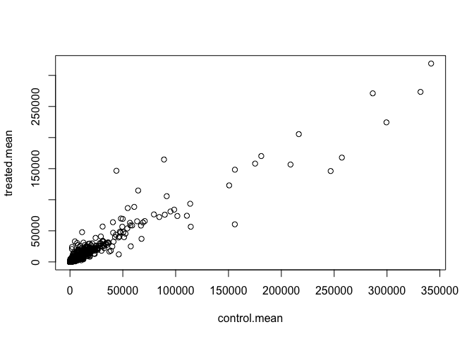
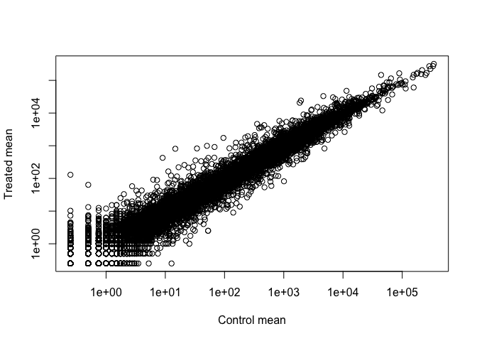
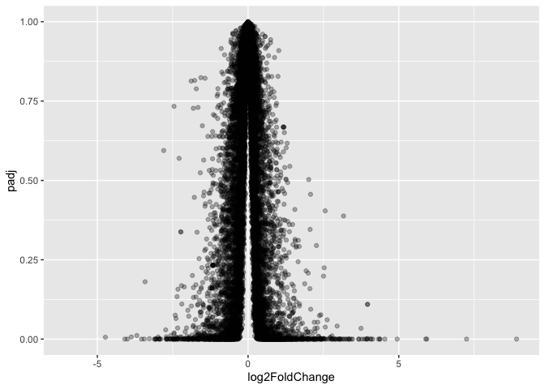
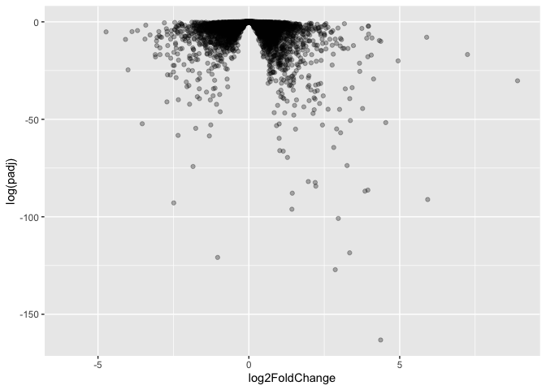
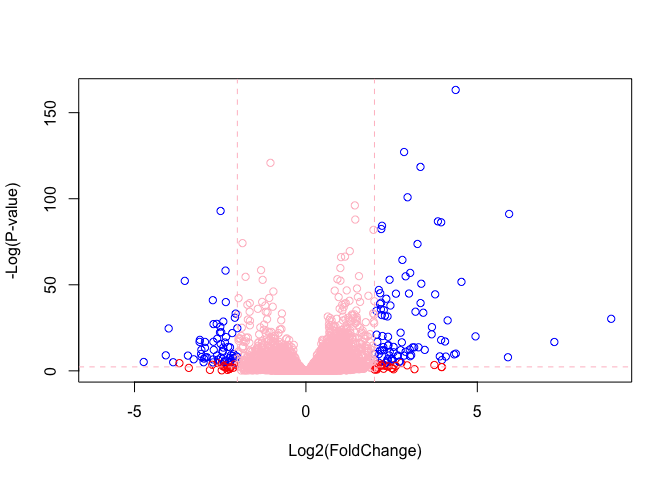

# lab 13
Niam Shasha

- [Background](#background)
- [Data Import](#data-import)
  - [DESeq analysis](#deseq-analysis)
  - [Volcano plot](#volcano-plot)
  - [Save our results to date](#save-our-results-to-date)
  - [Adding annotation data](#adding-annotation-data)
  - [Pathway analysis](#pathway-analysis)
  - [Save our annotated results](#save-our-annotated-results)

## Background

We will do RNA-seq analysis of a data set on the common steroid (dex)
and DESeq will be used for this analysis

# Data Import

``` r
counts <- read.csv("airway_scaledcounts.csv", row.names=1)
metadata <-  read.csv("airway_metadata.csv")
```

``` r
head(counts)
```

                    SRR1039508 SRR1039509 SRR1039512 SRR1039513 SRR1039516
    ENSG00000000003        723        486        904        445       1170
    ENSG00000000005          0          0          0          0          0
    ENSG00000000419        467        523        616        371        582
    ENSG00000000457        347        258        364        237        318
    ENSG00000000460         96         81         73         66        118
    ENSG00000000938          0          0          1          0          2
                    SRR1039517 SRR1039520 SRR1039521
    ENSG00000000003       1097        806        604
    ENSG00000000005          0          0          0
    ENSG00000000419        781        417        509
    ENSG00000000457        447        330        324
    ENSG00000000460         94        102         74
    ENSG00000000938          0          0          0

``` r
head(metadata)
```

              id     dex celltype     geo_id
    1 SRR1039508 control   N61311 GSM1275862
    2 SRR1039509 treated   N61311 GSM1275863
    3 SRR1039512 control  N052611 GSM1275866
    4 SRR1039513 treated  N052611 GSM1275867
    5 SRR1039516 control  N080611 GSM1275870
    6 SRR1039517 treated  N080611 GSM1275871

metadata tels us what is actually in the columns of our `counts` object

``` r
metadata
```

              id     dex celltype     geo_id
    1 SRR1039508 control   N61311 GSM1275862
    2 SRR1039509 treated   N61311 GSM1275863
    3 SRR1039512 control  N052611 GSM1275866
    4 SRR1039513 treated  N052611 GSM1275867
    5 SRR1039516 control  N080611 GSM1275870
    6 SRR1039517 treated  N080611 GSM1275871
    7 SRR1039520 control  N061011 GSM1275874
    8 SRR1039521 treated  N061011 GSM1275875

``` r
colnames(counts) == metadata$id
```

    [1] TRUE TRUE TRUE TRUE TRUE TRUE TRUE TRUE

> Q1. How many genes are in this dataset?

These are 38694 genes in the dataset

38694 genes \>Q2. How many ‘control’ cell lines do we have?

``` r
sum(metadata$dex == "control")
```

    [1] 4

4 control cell lines

- Find the control columns in our `counts` object
- Extract just the “control” column values for all genes
- Calculate the average value per gene in these “control” columns

``` r
control.inds <- metadata$dex == "control"
control.counts <- counts [,control.inds]
control.mean <- rowMeans(control.counts)
```

``` r
head(control.mean)
```

    ENSG00000000003 ENSG00000000005 ENSG00000000419 ENSG00000000457 ENSG00000000460 
             900.75            0.00          520.50          339.75           97.25 
    ENSG00000000938 
               0.75 

``` r
treated.inds <- metadata$dex == "treated"
treated.counts <- counts [,treated.inds]
treated.mean <- rowMeans(treated.counts)
```

``` r
head(treated.mean)
```

    ENSG00000000003 ENSG00000000005 ENSG00000000419 ENSG00000000457 ENSG00000000460 
             658.00            0.00          546.00          316.50           78.75 
    ENSG00000000938 
               0.00 

``` r
metadata <- metadata[match(colnames(counts), metadata$id),]
```

> Q3. How would you make the above code in either approach more robust?
> Is there a function that could help here?

I would use the function rowMeans() so that the code can work even if
the sample size changees. Another approach is using `match()`to ensure
that the metadata matches the count data column.

> Q4. Follow the same procedure for the treated samples (i.e. calculate
> the mean per gene across drug treated samples and assign to a labeled
> vector called treated.mean) Hint (click to expand)

``` r
treated.mean <- rowMeans( counts[,metadata$dex == "treated"])
head(treated.mean)
```

    ENSG00000000003 ENSG00000000005 ENSG00000000419 ENSG00000000457 ENSG00000000460 
             658.00            0.00          546.00          316.50           78.75 
    ENSG00000000938 
               0.00 

For book-keeping let’s store these together as a new object called
`meancounts`

``` r
meancounts <- data.frame(control.mean, treated.mean)
head(meancounts)
```

                    control.mean treated.mean
    ENSG00000000003       900.75       658.00
    ENSG00000000005         0.00         0.00
    ENSG00000000419       520.50       546.00
    ENSG00000000457       339.75       316.50
    ENSG00000000460        97.25        78.75
    ENSG00000000938         0.75         0.00

> Q5 (a). Create a scatter plot showing the mean of the treated samples
> against the mean of the control samples. Your plot should look
> something like the following.

``` r
plot(meancounts)
```



> Q5 (b).You could also use the ggplot2 package to make this figure
> producing the plot below. What geom\_?() function would you use for
> this plot?

I would use geom_point(), following code is below:

``` r
library(ggplot2)
ggplot(meancounts) +
aes(x = control.mean, y = treated.mean) +
geom_point()
```


Our count data is highly skewed and when wwe see a pattern like this
plot it requires log to transform it

> Q6. Try plotting both axes on a log scale. What is the argument to
> plot() that allows you to do this?

The argument is log= “xy”

``` r
plot(meancounts, log ="xy")
```

    Warning in xy.coords(x, y, xlabel, ylabel, log): 15032 x values <= 0 omitted
    from logarithmic plot

    Warning in xy.coords(x, y, xlabel, ylabel, log): 15281 y values <= 0 omitted
    from logarithmic plot


We most often use log2 transform for this kind of data in bioinformatics
because it makes the interpretation much easier

``` r
plot(meancounts$control.mean,
meancounts$treated.mean,
log = "xy",
xlab = "Control mean",
ylab = "Treated mean")
```

    Warning in xy.coords(x, y, xlabel, ylabel, log): 15032 x values <= 0 omitted
    from logarithmic plot

    Warning in xy.coords(x, y, xlabel, ylabel, log): 15281 y values <= 0 omitted
    from logarithmic plot



We call this little fraction the **log2 fold change** as it tells us how
much more or less gene expression we have in units of doubling,

Let’s calculate the log2fold change for our `treated.mean` and
`control.mean` counts and call this `log2fc`.

``` r
meancounts$log2fc <- log2(meancounts$treated.mean /
                            meancounts$control.mean)


head(meancounts)
```

                    control.mean treated.mean      log2fc
    ENSG00000000003       900.75       658.00 -0.45303916
    ENSG00000000005         0.00         0.00         NaN
    ENSG00000000419       520.50       546.00  0.06900279
    ENSG00000000457       339.75       316.50 -0.10226805
    ENSG00000000460        97.25        78.75 -0.30441833
    ENSG00000000938         0.75         0.00        -Inf

A common “rule of thumb” threshold for calling a gene “up regulated” or
“down regulated” is a log2 fold-change value of +2 or -2 (or greater)

``` r
zero.vals <- which(meancounts[,1:2]==0, arr.ind=TRUE)

to.rm <- unique(zero.vals[,1])
mycounts <- meancounts[-to.rm,]
head(mycounts)
```

                    control.mean treated.mean      log2fc
    ENSG00000000003       900.75       658.00 -0.45303916
    ENSG00000000419       520.50       546.00  0.06900279
    ENSG00000000457       339.75       316.50 -0.10226805
    ENSG00000000460        97.25        78.75 -0.30441833
    ENSG00000000971      5219.00      6687.50  0.35769358
    ENSG00000001036      2327.00      1785.75 -0.38194109

> Q7. What is the purpose of the arr.ind argument in the which()
> function call above? Why would we then take the first column of the
> output and need to call the unique() function?

this argument arr.ind=TRUE makes which() to return the row and column of
where the zero values are found.. The first column indicates which of
the genes contains these zeroes, then unique() is utilized so that the
gene can only be removed once, it endures that the rows are not taken
into measurment twice.

``` r
up.ind <- mycounts$log2fc > 2
down.ind <- mycounts$log2fc < (-2)

paste("Up:", sum(up.ind, na.rm = TRUE))
```

    [1] "Up: 250"

``` r
paste("Down:", sum(down.ind, na.rm = TRUE))
```

    [1] "Down: 367"

> Q8. Using the up.ind vector above can you determine how many up
> regulated genes we have at the greater than 2 fc level?

There are 250 up-regulated genes that are greater than 2 fc level

> Q9. Using the down.ind vector above can you determine how many down
> regulated genes we have at the greater than 2 fc level?

there are 367 down regulated genes

> Q10. Do you trust these results? Why or why not?

No, this is because fold change was used to analyze this data and this
makes a difference and be misleading because it engulfs large data set,
however p-value would not be significant.

## DESeq analysis

Let’s do this analysis properly and not forget about the significance of
the differences.

For this we will use the **DESeq2** package

``` r
library(DESeq2)
```

    Loading required package: S4Vectors

    Loading required package: stats4

    Loading required package: BiocGenerics

    Loading required package: generics


    Attaching package: 'generics'

    The following objects are masked from 'package:base':

        as.difftime, as.factor, as.ordered, intersect, is.element, setdiff,
        setequal, union


    Attaching package: 'BiocGenerics'

    The following objects are masked from 'package:stats':

        IQR, mad, sd, var, xtabs

    The following objects are masked from 'package:base':

        anyDuplicated, aperm, append, as.data.frame, basename, cbind,
        colnames, dirname, do.call, duplicated, eval, evalq, Filter, Find,
        get, grep, grepl, is.unsorted, lapply, Map, mapply, match, mget,
        order, paste, pmax, pmax.int, pmin, pmin.int, Position, rank,
        rbind, Reduce, rownames, sapply, saveRDS, table, tapply, unique,
        unsplit, which.max, which.min


    Attaching package: 'S4Vectors'

    The following object is masked from 'package:utils':

        findMatches

    The following objects are masked from 'package:base':

        expand.grid, I, unname

    Loading required package: IRanges

    Loading required package: GenomicRanges

    Loading required package: Seqinfo

    Loading required package: SummarizedExperiment

    Loading required package: MatrixGenerics

    Loading required package: matrixStats


    Attaching package: 'MatrixGenerics'

    The following objects are masked from 'package:matrixStats':

        colAlls, colAnyNAs, colAnys, colAvgsPerRowSet, colCollapse,
        colCounts, colCummaxs, colCummins, colCumprods, colCumsums,
        colDiffs, colIQRDiffs, colIQRs, colLogSumExps, colMadDiffs,
        colMads, colMaxs, colMeans2, colMedians, colMins, colOrderStats,
        colProds, colQuantiles, colRanges, colRanks, colSdDiffs, colSds,
        colSums2, colTabulates, colVarDiffs, colVars, colWeightedMads,
        colWeightedMeans, colWeightedMedians, colWeightedSds,
        colWeightedVars, rowAlls, rowAnyNAs, rowAnys, rowAvgsPerColSet,
        rowCollapse, rowCounts, rowCummaxs, rowCummins, rowCumprods,
        rowCumsums, rowDiffs, rowIQRDiffs, rowIQRs, rowLogSumExps,
        rowMadDiffs, rowMads, rowMaxs, rowMeans2, rowMedians, rowMins,
        rowOrderStats, rowProds, rowQuantiles, rowRanges, rowRanks,
        rowSdDiffs, rowSds, rowSums2, rowTabulates, rowVarDiffs, rowVars,
        rowWeightedMads, rowWeightedMeans, rowWeightedMedians,
        rowWeightedSds, rowWeightedVars

    Loading required package: Biobase

    Welcome to Bioconductor

        Vignettes contain introductory material; view with
        'browseVignettes()'. To cite Bioconductor, see
        'citation("Biobase")', and for packages 'citation("pkgname")'.


    Attaching package: 'Biobase'

    The following object is masked from 'package:MatrixGenerics':

        rowMedians

    The following objects are masked from 'package:matrixStats':

        anyMissing, rowMedians

To run a DEseq analysis we need at least two inputs:

- `countData` i.e are gene counts across different experiments
- `colData` i.e our metadara about those count columns

``` r
dds <- DESeqDataSetFromMatrix(countData=counts, 
                              colData=metadata, 
                              design= ~dex)
```

    converting counts to integer mode

    Warning in DESeqDataSet(se, design = design, ignoreRank): some variables in
    design formula are characters, converting to factors

``` r
dds
```

    class: DESeqDataSet 
    dim: 38694 8 
    metadata(1): version
    assays(1): counts
    rownames(38694): ENSG00000000003 ENSG00000000005 ... ENSG00000283120
      ENSG00000283123
    rowData names(0):
    colnames(8): SRR1039508 SRR1039509 ... SRR1039520 SRR1039521
    colData names(4): id dex celltype geo_id

Now we can run the DESeq analysis pipeline using this `dds` object that
has all the inpuys we need.

``` r
dds <- DESeq(dds)
```

    estimating size factors

    estimating dispersions

    gene-wise dispersion estimates

    mean-dispersion relationship

    final dispersion estimates

    fitting model and testing

``` r
res <- results(dds)
head(res)
```

    log2 fold change (MLE): dex treated vs control 
    Wald test p-value: dex treated vs control 
    DataFrame with 6 rows and 6 columns
                      baseMean log2FoldChange     lfcSE      stat    pvalue
                     <numeric>      <numeric> <numeric> <numeric> <numeric>
    ENSG00000000003 747.194195      -0.350703  0.168242 -2.084514 0.0371134
    ENSG00000000005   0.000000             NA        NA        NA        NA
    ENSG00000000419 520.134160       0.206107  0.101042  2.039828 0.0413675
    ENSG00000000457 322.664844       0.024527  0.145134  0.168996 0.8658000
    ENSG00000000460  87.682625      -0.147143  0.256995 -0.572550 0.5669497
    ENSG00000000938   0.319167      -1.732289  3.493601 -0.495846 0.6200029
                         padj
                    <numeric>
    ENSG00000000003  0.163017
    ENSG00000000005        NA
    ENSG00000000419  0.175937
    ENSG00000000457  0.961682
    ENSG00000000460  0.815805
    ENSG00000000938        NA

## Volcano plot

``` r
library(ggplot2)
```

``` r
ggplot(res) + 
  aes(log2FoldChange, padj) +
  geom_point(alpha=0.3)
```

    Warning: Removed 23549 rows containing missing values or values outside the scale range
    (`geom_point()`).



The plot is very useful becauase we don’t care about genes with high
p-values, we want the very low values below our alpha threshold
(e.g. 0.01)

Let’s log the y-axis so we can see these genes/points more clearly:

``` r
ggplot(res) + 
  aes(log2FoldChange, log(padj)) +
  geom_point(alpha=0.3)
```

    Warning: Removed 23549 rows containing missing values or values outside the scale range
    (`geom_point()`).



We need to flip the volcano

``` r
ggplot(res) + 
  aes(log2FoldChange, -log(padj)) +
  geom_point(alpha=0.3)
```

    Warning: Removed 23549 rows containing missing values or values outside the scale range
    (`geom_point()`).


> Q. Add annotation to this volcano plot including the log2 fold-change
> thresholds of +2 and -2 and the p-value threshold of 0.05. Also color
> up just the genes that meet both these thresholds. These are the ones
> we will focus on next day!

``` r
mycols <- rep("pink", nrow(res))
mycols[ abs(res$log2FoldChange) > 2 ]  <- "red" 

inds <- (res$padj < 0.01) & (abs(res$log2FoldChange) > 2 )
mycols[ inds ] <- "blue"

 
plot( res$log2FoldChange,  -log(res$padj), 
 col=mycols, ylab="-Log(P-value)", xlab="Log2(FoldChange)" )

abline(v=c(-2,2), col="pink", lty=2)
abline(h=-log(0.1), col="pink", lty=2)
```



## Save our results to date

``` r
write.csv(res, file="myresults.csv")
```

## Adding annotation data

For this we will use a couple of BioConductor packages that we can
install with:
’BiocManager::install(“AnnotationDbi”)`and`BiocManager::install(“org.Hs.eg.db”)\`

``` r
library(AnnotationDbi)
library(org.Hs.eg.db)
```

We can see the columns in `org.Hs.eg.db`

``` r
columns(org.Hs.eg.db)
```

     [1] "ACCNUM"       "ALIAS"        "ENSEMBL"      "ENSEMBLPROT"  "ENSEMBLTRANS"
     [6] "ENTREZID"     "ENZYME"       "EVIDENCE"     "EVIDENCEALL"  "GENENAME"    
    [11] "GENETYPE"     "GO"           "GOALL"        "IPI"          "MAP"         
    [16] "OMIM"         "ONTOLOGY"     "ONTOLOGYALL"  "PATH"         "PFAM"        
    [21] "PMID"         "PROSITE"      "REFSEQ"       "SYMBOL"       "UCSCKG"      
    [26] "UNIPROT"     

> Q11. Run the mapIds() function two more times to add the Entrez ID and
> UniProt accession and GENENAME as new columns called
> res$entrez, res$uniprot and res\$genename.

We can now use the `mapIDs()` to find different database identifiers:

``` r
res$symbol <- mapIds(org.Hs.eg.db,
                keys=row.names(res),
              keytype="ENSEMBL",
               column="SYMBOL")
```

    'select()' returned 1:many mapping between keys and columns

``` r
head(res)
```

    log2 fold change (MLE): dex treated vs control 
    Wald test p-value: dex treated vs control 
    DataFrame with 6 rows and 7 columns
                      baseMean log2FoldChange     lfcSE      stat    pvalue
                     <numeric>      <numeric> <numeric> <numeric> <numeric>
    ENSG00000000003 747.194195      -0.350703  0.168242 -2.084514 0.0371134
    ENSG00000000005   0.000000             NA        NA        NA        NA
    ENSG00000000419 520.134160       0.206107  0.101042  2.039828 0.0413675
    ENSG00000000457 322.664844       0.024527  0.145134  0.168996 0.8658000
    ENSG00000000460  87.682625      -0.147143  0.256995 -0.572550 0.5669497
    ENSG00000000938   0.319167      -1.732289  3.493601 -0.495846 0.6200029
                         padj      symbol
                    <numeric> <character>
    ENSG00000000003  0.163017      TSPAN6
    ENSG00000000005        NA        TNMD
    ENSG00000000419  0.175937        DPM1
    ENSG00000000457  0.961682       SCYL3
    ENSG00000000460  0.815805       FIRRM
    ENSG00000000938        NA         FGR

> Q. Can you map to “GENENAME” AND ADDS AS A NEW “COLUMN” to our `res`
> object?

``` r
res$GENENAME <- mapIds(org.Hs.eg.db,
                keys=row.names(res),
              keytype="ENSEMBL",
               column="GENENAME")
```

    'select()' returned 1:many mapping between keys and columns

> Q. Add “ENTREZID” as a res\$entrez?

``` r
res$entrez <- mapIds(org.Hs.eg.db,
                keys=row.names(res),
              keytype="ENSEMBL",
               column="ENTREZID")
```

    'select()' returned 1:many mapping between keys and columns

``` r
res$uniprot <- mapIds(org.Hs.eg.db,
keys = row.names(res),
keytype = "ENSEMBL",
column = "UNIPROT",
multiVals = "first")
```

    'select()' returned 1:many mapping between keys and columns

``` r
head(res)
```

    log2 fold change (MLE): dex treated vs control 
    Wald test p-value: dex treated vs control 
    DataFrame with 6 rows and 10 columns
                      baseMean log2FoldChange     lfcSE      stat    pvalue
                     <numeric>      <numeric> <numeric> <numeric> <numeric>
    ENSG00000000003 747.194195      -0.350703  0.168242 -2.084514 0.0371134
    ENSG00000000005   0.000000             NA        NA        NA        NA
    ENSG00000000419 520.134160       0.206107  0.101042  2.039828 0.0413675
    ENSG00000000457 322.664844       0.024527  0.145134  0.168996 0.8658000
    ENSG00000000460  87.682625      -0.147143  0.256995 -0.572550 0.5669497
    ENSG00000000938   0.319167      -1.732289  3.493601 -0.495846 0.6200029
                         padj      symbol               GENENAME      entrez
                    <numeric> <character>            <character> <character>
    ENSG00000000003  0.163017      TSPAN6          tetraspanin 6        7105
    ENSG00000000005        NA        TNMD            tenomodulin       64102
    ENSG00000000419  0.175937        DPM1 dolichyl-phosphate m..        8813
    ENSG00000000457  0.961682       SCYL3 SCY1 like pseudokina..       57147
    ENSG00000000460  0.815805       FIRRM FIGNL1 interacting r..       55732
    ENSG00000000938        NA         FGR FGR proto-oncogene, ..        2268
                        uniprot
                    <character>
    ENSG00000000003  A0A087WYV6
    ENSG00000000005      Q9H2S6
    ENSG00000000419      H0Y368
    ENSG00000000457      X6RHX1
    ENSG00000000460      A6NFP1
    ENSG00000000938      B7Z6W7

## Pathway analysis

The annotaed results with their log2 fold-change and p-values.

We will use the **gage** and **pathview** packages and install them
with: `BiocManager::install( c("pathview", "gage", "gageData") )`

``` r
library(gage)
```

``` r
library(gageData)
library(pathview)
```

    ##############################################################################
    Pathview is an open source software package distributed under GNU General
    Public License version 3 (GPLv3). Details of GPLv3 is available at
    http://www.gnu.org/licenses/gpl-3.0.html. Particullary, users are required to
    formally cite the original Pathview paper (not just mention it) in publications
    or products. For details, do citation("pathview") within R.

    The pathview downloads and uses KEGG data. Non-academic uses may require a KEGG
    license agreement (details at http://www.kegg.jp/kegg/legal.html).
    ##############################################################################

``` r
data(kegg.sets.hs)

head(kegg.sets.hs, 2)
```

    $`hsa00232 Caffeine metabolism`
    [1] "10"   "1544" "1548" "1549" "1553" "7498" "9"   

    $`hsa00983 Drug metabolism - other enzymes`
     [1] "10"     "1066"   "10720"  "10941"  "151531" "1548"   "1549"   "1551"  
     [9] "1553"   "1576"   "1577"   "1806"   "1807"   "1890"   "221223" "2990"  
    [17] "3251"   "3614"   "3615"   "3704"   "51733"  "54490"  "54575"  "54576" 
    [25] "54577"  "54578"  "54579"  "54600"  "54657"  "54658"  "54659"  "54963" 
    [33] "574537" "64816"  "7083"   "7084"   "7172"   "7363"   "7364"   "7365"  
    [41] "7366"   "7367"   "7371"   "7372"   "7378"   "7498"   "79799"  "83549" 
    [49] "8824"   "8833"   "9"      "978"   

``` r
x <- c(10, 9, 7)
names(x) <- c("alice", "chandea", "barry")
x
```

      alice chandea   barry 
         10       9       7 

``` r
names(x)
```

    [1] "alice"   "chandea" "barry"  

input vector called `foldchanges` that has “entrez” ids as names.

``` r
foldchanges <-  res$log2FoldChange
names(foldchanges) <-  res$entrez
```

NO we can run `gage()` to do our pathway analysis

``` r
keggres = gage(foldchanges, gsets=kegg.sets.hs)
```

``` r
attributes(keggres)
```

    $names
    [1] "greater" "less"    "stats"  

``` r
head(keggres$less, 3)
```

                                          p.geomean stat.mean        p.val
    hsa05332 Graft-versus-host disease 0.0004250607 -3.473335 0.0004250607
    hsa04940 Type I diabetes mellitus  0.0017820379 -3.002350 0.0017820379
    hsa05310 Asthma                    0.0020046180 -3.009045 0.0020046180
                                            q.val set.size         exp1
    hsa05332 Graft-versus-host disease 0.09053792       40 0.0004250607
    hsa04940 Type I diabetes mellitus  0.14232788       42 0.0017820379
    hsa05310 Asthma                    0.14232788       29 0.0020046180

> Q12. Can you do the same procedure as above to plot the pathview
> figures for the top 2 down-reguled pathways?

``` r
down.pathways <- rownames(keggres$less)[1:2]
down.ids <- substr(down.pathways, start = 1, stop = 8)
down.ids
```

    [1] "hsa05332" "hsa04940"

Now we can use the **pathview** package with the found KEGG pathway IDs
(e.g. “hsa05310” for the asthma pathway) to make a figure showing our
differential expressed genes (DEGs)

``` r
pathview(gene.data=foldchanges, pathway.id="hsa05310")
```

    'select()' returned 1:1 mapping between keys and columns

    Info: Working in directory /Users/niamshasha/Desktop/BIMM143/bimm143_github/class13

    Info: Writing image file hsa05310.pathview.png


``` r
knitr::include_graphics("download.png")
```


## Save our annotated results

``` r
write.csv(res, file="myresults_annotated.csv")
```
