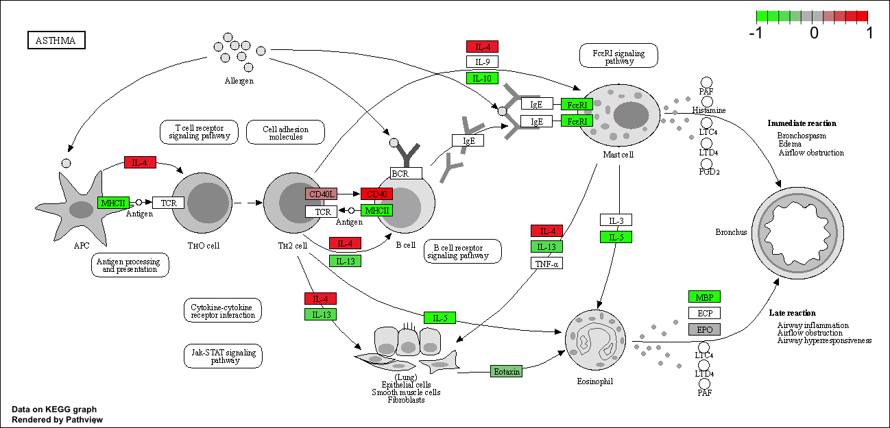

## Background

We will do RNA-seq analysis of a data set on the common steroid (dex) and DESeq will be used for this analysis

# Data Import

```{r}
counts <- read.csv("airway_scaledcounts.csv", row.names=1)
metadata <-  read.csv("airway_metadata.csv")
```


```{r}
head(counts)
```

```{r}
head(metadata)

```

metadata tels us what is actually in the columns of our `counts` object

```{r}
metadata
```

```{r}
colnames(counts) == metadata$id
```


>Q1. How many genes are in this dataset? 

These are `r nrow(counts)` genes in the dataset

38694 genes 
>Q2. How many ‘control’ cell lines do we have? 

```{r}
sum(metadata$dex == "control")
```


4 control cell lines

- Find the control columns in our `counts` object 
- Extract just the "control" column values for all genes 
- Calculate the average value per gene in these "control" columns 

```{r}
control.inds <- metadata$dex == "control"
control.counts <- counts [,control.inds]
control.mean <- rowMeans(control.counts)
```

```{r}
head(control.mean)
```

```{r}
treated.inds <- metadata$dex == "treated"
treated.counts <- counts [,treated.inds]
treated.mean <- rowMeans(treated.counts)
```

```{r}
head(treated.mean)
```
```{r}
metadata <- metadata[match(colnames(counts), metadata$id),]
```

>Q3. How would you make the above code in either approach more robust? Is there a function that could help here? 

I would use the function rowMeans() so that the code can work even if the sample size changees. Another approach is using `match()`to ensure that the metadata matches the count data column. 

>Q4. Follow the same procedure for the treated samples (i.e. calculate the mean per gene across drug treated samples and assign to a labeled vector called treated.mean)
Hint (click to expand)


```{r}
treated.mean <- rowMeans( counts[,metadata$dex == "treated"])
head(treated.mean)
```
For book-keeping let's store these together as a new object called `meancounts`

```{r}
meancounts <- data.frame(control.mean, treated.mean)
head(meancounts)
```

>Q5 (a). Create a scatter plot showing the mean of the treated samples against the mean of the control samples. Your plot should look something like the following.


```{r}
plot(meancounts)
```

>Q5 (b).You could also use the ggplot2 package to make this figure producing the plot below. What geom_?() function would you use for this plot? 

 I would use geom_point(), following code is below:

```{r}
library(ggplot2)
ggplot(meancounts) +
aes(x = control.mean, y = treated.mean) +
geom_point()
```


Our count data is highly skewed and when wwe see a pattern like this plot it requires log to transform it


>Q6. Try plotting both axes on a log scale. What is the argument to plot() that allows you to do this? 

The argument is log= "xy"

```{r}
plot(meancounts, log ="xy")
```


We most often use log2 transform for this kind of data in bioinformatics because it makes the interpretation much easier 

```{r}
plot(meancounts$control.mean,
meancounts$treated.mean,
log = "xy",
xlab = "Control mean",
ylab = "Treated mean")
```

We call this little fraction the **log2 fold change** as it tells us how much more or less gene expression we have in units of doubling, 


Let's calculate the log2fold change for our `treated.mean` and `control.mean` counts and call this `log2fc`. 

```{r}
meancounts$log2fc <- log2(meancounts$treated.mean /
                            meancounts$control.mean)


head(meancounts)
```

A common "rule of thumb" threshold for calling a gene "up regulated" or "down regulated" is a log2 fold-change value of +2 or -2 (or greater)


```{r}
zero.vals <- which(meancounts[,1:2]==0, arr.ind=TRUE)

to.rm <- unique(zero.vals[,1])
mycounts <- meancounts[-to.rm,]
head(mycounts)
```


>Q7. What is the purpose of the arr.ind argument in the which() function call above? Why would we then take the first column of the output and need to call the unique() function?

this argument arr.ind=TRUE  makes which() to return the row and column of where the zero values are found.. The first column indicates which of the genes contains these zeroes, then unique() is utilized so that the gene can only be removed once, it endures that the rows are not taken into measurment twice.  


```{r}
up.ind <- mycounts$log2fc > 2
down.ind <- mycounts$log2fc < (-2)

paste("Up:", sum(up.ind, na.rm = TRUE))
paste("Down:", sum(down.ind, na.rm = TRUE))
```

>Q8. Using the up.ind vector above can you determine how many up regulated genes we have at the greater than 2 fc level? 

There are 250 up-regulated genes that are greater than 2 fc level

>Q9. Using the down.ind vector above can you determine how many down regulated genes we have at the greater than 2 fc level? 

there are 367 down regulated genes 

>Q10. Do you trust these results? Why or why not?

No, this is because fold change was used to analyze this data and this makes a difference and be misleading because it engulfs large data set, however p-value would not be significant. 

## DESeq analysis

Let's do this analysis properly and not forget about the significance of the differences. 

For this we will use the **DESeq2** package 

```{r, messsage=FALSE}
library(DESeq2)
```


To run a DEseq analysis we need at least two inputs: 

- `countData` i.e are gene counts across different experiments
- `colData` i.e our metadara about those count columns 

```{r}
dds <- DESeqDataSetFromMatrix(countData=counts, 
                              colData=metadata, 
                              design= ~dex)
dds
```

Now we can run the DESeq analysis pipeline using this `dds` object that has all the inpuys we need. 

```{r}
dds <- DESeq(dds)
res <- results(dds)
head(res)
```

## Volcano plot 

```{r}
library(ggplot2)
```


```{r}
ggplot(res) + 
  aes(log2FoldChange, padj) +
  geom_point(alpha=0.3)
```


The plot is very useful becauase we don't care about genes with high p-values, we want the very low values below our alpha threshold (e.g. 0.01)

Let's log the y-axis so we can see these genes/points more clearly: 

```{r}
ggplot(res) + 
  aes(log2FoldChange, log(padj)) +
  geom_point(alpha=0.3)
```

We need to flip the volcano 

```{r}
ggplot(res) + 
  aes(log2FoldChange, -log(padj)) +
  geom_point(alpha=0.3)
```

> Q. Add annotation to this volcano plot including the log2 fold-change thresholds of +2 and -2 and the p-value threshold of 0.05. Also color up just the genes that meet both these thresholds. These are the ones we will focus on next day!

```{r}

mycols <- rep("pink", nrow(res))
mycols[ abs(res$log2FoldChange) > 2 ]  <- "red" 

inds <- (res$padj < 0.01) & (abs(res$log2FoldChange) > 2 )
mycols[ inds ] <- "blue"

 
plot( res$log2FoldChange,  -log(res$padj), 
 col=mycols, ylab="-Log(P-value)", xlab="Log2(FoldChange)" )

abline(v=c(-2,2), col="pink", lty=2)
abline(h=-log(0.1), col="pink", lty=2)
```


## Save our results to date 

```{r}
write.csv(res, file="myresults.csv")
```


## Adding annotation data

For this we will use a couple of BioConductor packages that we can install with: 'BiocManager::install("AnnotationDbi")` and  `BiocManager::install("org.Hs.eg.db")`

```{r, message=FALSE}
library(AnnotationDbi)
library(org.Hs.eg.db)
```

We can see the columns in `org.Hs.eg.db`

```{r}
columns(org.Hs.eg.db)
```

>Q11. Run the mapIds() function two more times to add the Entrez ID and UniProt accession and GENENAME as new columns called res$entrez, res$uniprot and res$genename.

We can now use the `mapIDs()`  to find different database identifiers:


```{r}
res$symbol <- mapIds(org.Hs.eg.db,
                keys=row.names(res),
              keytype="ENSEMBL",
               column="SYMBOL")
```

```{r}
head(res)
```


>Q. Can you map to "GENENAME" AND ADDS AS A NEW "COLUMN" to our `res` object?

```{r}
res$GENENAME <- mapIds(org.Hs.eg.db,
                keys=row.names(res),
              keytype="ENSEMBL",
               column="GENENAME")
```

>Q. Add “ENTREZID” as a res$entrez?

```{r}
res$entrez <- mapIds(org.Hs.eg.db,
                keys=row.names(res),
              keytype="ENSEMBL",
               column="ENTREZID")
```

```{r}
res$uniprot <- mapIds(org.Hs.eg.db,
keys = row.names(res),
keytype = "ENSEMBL",
column = "UNIPROT",
multiVals = "first")
```


```{r}
head(res)
```


## Pathway analysis 
 
The  annotaed results with their log2 fold-change and p-values.


We will use the **gage** and **pathview** packages and install them with: `BiocManager::install( c("pathview", "gage", "gageData") )`

```{r}
library(gage)
library(gageData)
library(pathview)
```

```{r}
data(kegg.sets.hs)

head(kegg.sets.hs, 2)
```

```{r}
x <- c(10, 9, 7)
names(x) <- c("alice", "chandea", "barry")
x
```

```{r}
names(x)
```

 input vector called `foldchanges` that has "entrez" ids as names. 

```{r}
foldchanges <-  res$log2FoldChange
names(foldchanges) <-  res$entrez
```

NO we can run `gage()` to do our pathway analysis 

```{r}
keggres = gage(foldchanges, gsets=kegg.sets.hs)

```


```{r}
attributes(keggres)
```

```{r}
head(keggres$less, 3)
```

>Q12. Can you do the same procedure as above to plot the pathview figures for the top 2 down-reguled pathways?

```{r}
down.pathways <- rownames(keggres$less)[1:2]
down.ids <- substr(down.pathways, start = 1, stop = 8)
down.ids
```

Now we can use the **pathview** package with the found KEGG pathway IDs (e.g. "hsa05310" for the asthma pathway) to make a figure showing our differential expressed genes (DEGs) 

```{r}
pathview(gene.data=foldchanges, pathway.id="hsa05310")

```



```{r}

```

## Save our annotated results 

```{r}
write.csv(res, file="myresults_annotated.csv")
```


